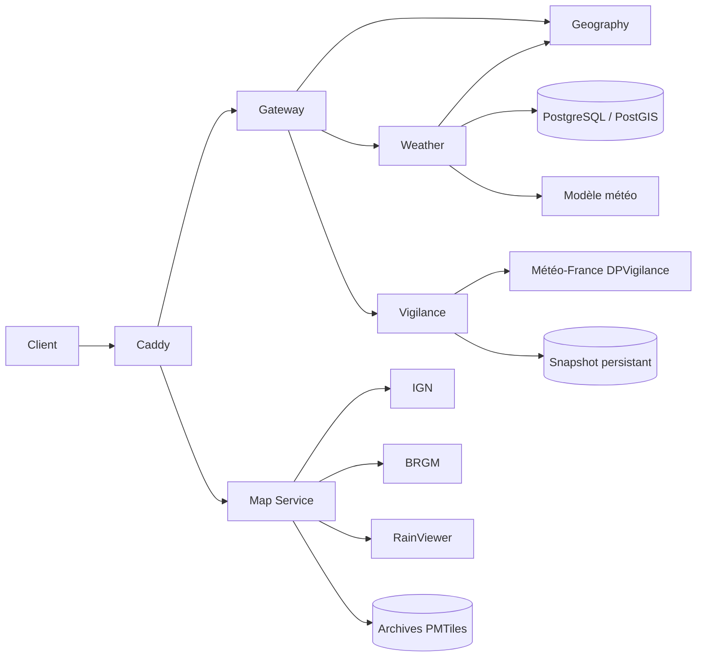

# Microservices OpenDataVal

> Index des services v2.
> Dernière mise à jour : 2026-07-25 · Dernière vérification : 2026-07-25

## Vue d’ensemble

| Service | Code | Route publique principale | Route interne principale | Responsabilité |
|---|---|---|---|---|
| [Gateway Service](gateway-service/README.md) | `apps/gateway-service/` | `/api/v2/*` | — | Façade HTTP, validation d’entrée, propagation du `request-id` et routage |
| [Geography Service](geography-service/README.md) | `apps/geography-service/` | `/api/v2/geography/resolve` | `/internal/v1/geography/resolve` | Territoire, adresse postale et altitude d’un point |
| [Weather Service](weather-service/README.md) | `apps/weather-service/` | `/api/v2/weather/temperature` | `/internal/v1/weather/temperature` | Température ponctuelle selon la méthode Météo V2 |
| [Map Service](map-service/README.md) | `apps/map-service/` | `/api/v2/map/*` | `/internal/v1/map/metrics` | Styles, tuiles, relief, glyphes et légendes cartographiques |
| [Weather Vigilance](weather-vigilance/README.md) | `services/weather-vigilance/` | `/api/v2/vigilance` | `/v1/vigilance/departments/{code}` | Vigilance météorologique officielle à l’échelle départementale |

Le service Copernicus existe également dans ce dossier mais conserve son cycle d’exploitation propre.

## Chaîne d’appel



`map-service` constitue l’exception documentée à la façade gateway : Caddy route directement ses ressources binaires et ses styles sous `/api/v2/map/*`.

## Conventions communes

- Le navigateur n’appelle pas directement les routes internes.
- Les API métier v2 passent par le gateway ; les ressources cartographiques passent directement de Caddy vers `map-service` conformément à l’ADR 008.
- `x-request-id` est accepté en entrée et renvoyé dans les réponses.
- Les erreurs publiques JSON suivent autant que possible la forme `{ error: { code, message, retryable }, requestId }`.
- Les services métier ne doivent pas être absorbés par le gateway ni par `map-service`.
- `/health` ou `/healthz` vérifie la vie du processus ; `/ready` ou `/readyz` décrit la capacité du service selon sa propre politique.
- Les routes historiques `/api/*` du monolithe restent indépendantes pendant la migration v2.

## Validation rapide

```bash
pnpm check:gateway
pnpm --filter geography-service typecheck
pnpm test:geography
pnpm check:weather
pnpm check:map
npm run check:vigilance
```

Contrôle via Caddy après déploiement :

```bash
curl -fsS http://localhost:8080/api/v2/gateway
curl -fsS "http://localhost:8080/api/v2/geography/resolve?lat=44.0812&lon=3.6421"
curl -fsS "http://localhost:8080/api/v2/weather/temperature?lat=44.0812&lon=3.6421"
curl -fsS http://localhost:8080/api/v2/map/styles/territoire.json
curl -fsS "http://localhost:8080/api/v2/vigilance?department_code=30"
```

Le `Caddyfile` étant embarqué dans l’image, toute modification de routage nécessite une reconstruction de l’image `caddy`.
