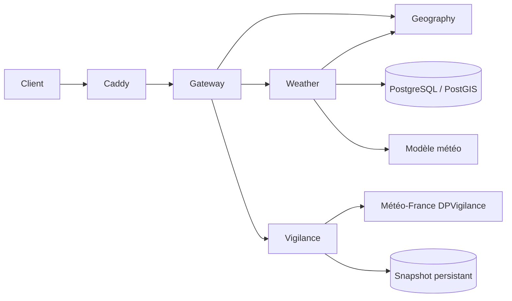

# Microservices OpenDataVal

> Index des services v2 déployés derrière le gateway.
> Dernière mise à jour : 2026-07-24 · Dernière vérification : 2026-07-24

## Vue d’ensemble

| Service | Code | Route publique principale | Route interne principale | Responsabilité |
|---|---|---|---|---|
| [Gateway Service](gateway-service/README.md) | `apps/gateway-service/` | `/api/v2/*` | — | Façade HTTP, validation d’entrée, propagation du `request-id` et routage |
| [Geography Service](geography-service/README.md) | `apps/geography-service/` | `/api/v2/geography/resolve` | `/internal/v1/geography/resolve` | Territoire, adresse postale et altitude d’un point |
| [Weather Service](weather-service/README.md) | `apps/weather-service/` | `/api/v2/weather/temperature` | `/internal/v1/weather/temperature` | Température ponctuelle selon la méthode Météo V2 |
| [Weather Vigilance](weather-vigilance/README.md) | `services/weather-vigilance/` | `/api/v2/vigilance` | `/v1/vigilance/departments/{code}` | Vigilance météorologique officielle à l’échelle départementale |

Le service Copernicus existe également dans ce dossier, mais il est volontairement hors périmètre de la mise à jour du 24 juillet 2026.

## Chaîne d’appel



Pour une requête Vigilance par coordonnées, le gateway appelle d’abord Geography afin de déterminer le département, puis interroge Weather Vigilance. Une requête avec `department_code` contourne cette résolution géographique.

## Conventions communes

- Le navigateur n’appelle pas directement les routes internes : les API v2 publiques passent par le gateway.
- `x-request-id` est accepté en entrée, propagé aux dépendances et renvoyé dans l’en-tête ainsi que dans les réponses JSON.
- Les erreurs publiques suivent autant que possible la forme `{ error: { code, message, retryable }, requestId }`.
- Les services métier ne doivent pas être absorbés par le gateway : celui-ci reste une façade sans logique métier ni accès direct à la base.
- `/health` ou `/healthz` vérifie la vie du processus ; `/ready` ou `/readyz` décrit la capacité du service à répondre selon sa propre politique.
- Les routes historiques `/api/*` du monolithe restent indépendantes pendant la migration v2.

## Validation rapide

```bash
pnpm check:gateway
pnpm --filter geography-service typecheck
pnpm test:geography
pnpm check:weather
npm run check:vigilance
```

Contrôle via Caddy après déploiement :

```bash
curl -fsS http://localhost:8080/api/v2/gateway
curl -fsS "http://localhost:8080/api/v2/geography/resolve?lat=44.0812&lon=3.6421"
curl -fsS "http://localhost:8080/api/v2/weather/temperature?lat=44.0812&lon=3.6421"
curl -fsS "http://localhost:8080/api/v2/vigilance?department_code=30"
```

Le `Caddyfile` étant embarqué dans l’image, toute modification de routage nécessite une reconstruction de l’image `caddy`.
