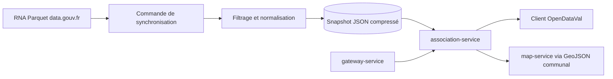

# Association Service — plan MVP

> Statut : proposition d’implémentation
> Périmètre initial : Val-d’Aigoual, code INSEE `30339`
> Architecture cible : microservice v2 derrière `gateway-service`
> Sources vérifiées le 27 juillet 2026

## 1. Objectif

Créer un microservice simple et fiable permettant de consulter les associations déclarées sur une commune française, avec un premier déploiement limité à Val-d’Aigoual.

Le MVP doit répondre à quatre questions :

1. Quelles associations sont rattachchées à la commune ?
2. Quel est leur objet et leur domaine d’activité ?
3. Sont-elles administrativement actives, dissoutes ou de statut incertain ?
4. Quand et depuis quelle source les informations ont-elles été mises à jour ?

Le service ne doit pas prétendre mesurer l’activité réelle d’une association. Le statut RNA indique une situation administrative, pas la tenue récente d’activités locales.

## 2. Périmètre fonctionnel

### Inclus

- recherche par code INSEE ;
- recherche textuelle sur le titre, le sigle et l’objet ;
- filtre par statut administratif ;
- filtre par catégorie RNA ;
- fiche synthétique d’une association ;
- statistiques simples par commune ;
- export JSON, CSV et GeoJSON ;
- provenance, date de mise à jour et état de fraîcheur ;
- gestion des anciennes communes composant Val-d’Aigoual ;
- localisation cartographique au centroïde communal uniquement.

### Hors périmètre

- annuaire des dirigeants ou membres ;
- publication de coordonnées personnelles ;
- subventions, comptes annuels et effectifs salariés ;
- validation par la mairie ;
- historique détaillé des annonces JOAFE ;
- géocodage précis du siège ;
- contribution directe des associations ;
- couverture nationale chargée intégralement en mémoire.

## 3. Sources de données

### Source principale

**RNA agrégé à l’échelle nationale**, publié sur data.gouv.fr en CSV et Parquet et reconstruit à partir des fichiers RNA Import et Waldec.

- jeu de données : `https://www.data.gouv.fr/datasets/rna-agrege-a-lechelle-nationale`
- format recommandé : Parquet ;
- fréquence de contrôle : hebdomadaire ;
- fréquence réelle attendue de la source : mensuelle ;
- licence : Licence Ouverte 2.0.

### Sources facultatives du MVP

- référentiel des communes via `geo.api.gouv.fr` ;
- centroïdes communaux déjà disponibles dans la pile géographique OpenDataVal.

Le MVP ne dépend pas de l’API Association pour fonctionner. Cette API peut nécessiter un accès et des paramètres propres à API Entreprise ; elle sera traitée comme enrichissement facultatif dans le produit complet.

## 4. Cas particulier de Val-d’Aigoual

Val-d’Aigoual est une commune nouvelle. Le filtre d’import doit reconnaître :

| Territoire source | Code ou libellé |
|---|---|
| Val-d’Aigoual actuel | `30339` |
| Ancienne commune de Valleraugue | `30339` et libellé `VALLERAUGUE` |
| Ancienne commune de Notre-Dame-de-la-Rouvière | `30190` |
| Libellés possibles | `VAL-D'AIGOUAL`, `VALLERAUGUE`, `NOTRE-DAME-DE-LA-ROUVIERE` |
| Code postal indicatif | `30570` |

La normalisation doit produire `codeInsee = 30339` tout en conservant `sourceCommuneCode` et `sourceCommuneName` pour l’audit.

Les correspondances historiques doivent être stockées dans un petit référentiel versionné, et non codées directement dans les fonctions métier.

## 5. Architecture MVP



### Composants

- `apps/association-service/` : API Node.js / TypeScript ;
- `scripts/sync-rna.ts` : téléchargement, filtrage et production du snapshot ;
- volume persistant : `/var/lib/opendataval/association-service/` ;
- snapshot courant : `associations-30339.json.gz` ;
- manifeste : `manifest.json` avec URL, empreinte, date source, date de génération et nombre de lignes ;
- image Docker indépendante ;
- routage public par `gateway-service`.

### Choix de stockage

Aucune base de données métier pour le MVP.

Le service charge en mémoire uniquement le snapshot des communes configurées. Le dernier snapshot valide est conservé après redémarrage. Une synchronisation en échec ne doit jamais remplacer le snapshot courant.

## 6. Modèle de données public

```ts
export type AssociationSummary = {
  rnaId: string | null;
  legacyId: string | null;
  title: string;
  shortTitle: string | null;
  purpose: string | null;
  categoryPrimary: string | null;
  categorySecondary: string | null;
  administrativeStatus: "active" | "dissolved" | "unknown";
  creationDate: string | null;
  declarationDate: string | null;
  dissolutionDate: string | null;
  website: string | null;
  siren: string | null;
  siret: string | null;
  municipality: {
    codeInsee: string;
    name: string;
    postalCode: string | null;
    sourceCommuneCode: string | null;
    sourceCommuneName: string | null;
  };
  location: {
    type: "municipality_centroid";
    latitude: number;
    longitude: number;
    precision: "municipality";
  } | null;
  source: {
    name: "RNA";
    sourceUpdatedAt: string | null;
    importedAt: string;
  };
};
```

### Règles de confidentialité

- ne jamais exposer le nom d’un dirigeant ou d’un membre ;
- ne pas exposer de courriel, téléphone ou adresse personnelle ;
- ne pas publier l’adresse précise du siège dans le MVP ;
- publier uniquement la commune, le code postal et le centroïde communal ;
- conserver seulement les champs nécessaires au service public rendu.

## 7. API publique

### Liste et recherche

```http
GET /api/v2/associations?code_insee=30339
GET /api/v2/associations?code_insee=30339&q=patrimoine
GET /api/v2/associations?code_insee=30339&status=active
GET /api/v2/associations?code_insee=30339&category=culture
```

Paramètres :

- `code_insee` obligatoire ;
- `q`, `status`, `category` facultatifs ;
- `limit` borné à 100 ;
- `cursor` pour la pagination stable ;
- tri par défaut : titre normalisé.

### Fiche

```http
GET /api/v2/associations/{rnaId}
```

Les associations anciennes sans numéro RNA utilisent une route interne par `legacyId`, mais ne doivent pas provoquer de collision avec les numéros RNA.

### Statistiques

```http
GET /api/v2/associations/stats?code_insee=30339
```

Réponse minimale :

- total ;
- nombre par statut ;
- nombre par catégorie principale ;
- créations par année ;
- proportion de fiches avec SIREN/SIRET ;
- date du snapshot.

### Cartographie

```http
GET /api/v2/associations/map?code_insee=30339
```

Retourne un `FeatureCollection` GeoJSON. Toutes les associations du MVP sont positionnées au centroïde de la commune avec `location_precision = municipality`. Le client doit agréger les points superposés.

### Export

```http
GET /api/v2/associations/export?code_insee=30339&format=json
GET /api/v2/associations/export?code_insee=30339&format=csv
GET /api/v2/associations/export?code_insee=30339&format=geojson
```

### Exploitation

```http
GET /healthz
GET /readyz
GET /internal/v1/associations/status
POST /internal/v1/associations/sync
```

La route de synchronisation est interne, protégée et non exposée par Caddy.

## 8. Normalisation et déduplication

Ordre de priorité des identifiants :

1. numéro RNA ;
2. identifiant historique fourni par le fichier Import ;
3. identifiant synthétique stable construit à partir de la source.

Règles :

- une ligne Waldec et une ligne Import ne doivent jamais être fusionnées sur le seul titre ;
- dédupliquer par identifiant officiel ;
- normaliser les espaces, apostrophes, accents et majuscules uniquement pour la recherche ;
- conserver les valeurs originales pour l’affichage ;
- convertir les dates invalides en `null` avec un avertissement de qualité ;
- ne jamais transformer un statut absent en `active` ;
- conserver la trace de la ligne source et du fichier d’origine dans le snapshot interne.

## 9. Fraîcheur et résilience

États publics :

- `fresh` : snapshot de moins de 45 jours ;
- `stale` : snapshot de 45 à 90 jours ;
- `expired` : snapshot de plus de 90 jours ;
- `unavailable` : aucun snapshot valide.

Comportement :

- téléchargement dans un fichier temporaire ;
- validation du schéma et du nombre de lignes avant publication ;
- calcul SHA-256 ;
- remplacement atomique du snapshot ;
- conservation du snapshot précédent ;
- restauration automatique après redémarrage ;
- réponse avec données anciennes et `freshness_status=stale` plutôt qu’une panne totale.

## 10. Étapes d’implémentation

### Étape 1 — Contrat et fixtures

- créer les types TypeScript ;
- définir les schémas Zod ;
- ajouter une fixture RNA réduite couvrant Waldec, Import, dissolution et données manquantes ;
- documenter les alias communaux de Val-d’Aigoual.

### Étape 2 — Synchronisation

- télécharger le Parquet ;
- sélectionner uniquement les colonnes nécessaires ;
- filtrer les communes configurées ;
- normaliser les lignes ;
- générer le snapshot et le manifeste ;
- rendre l’opération idempotente.

### Étape 3 — API

- implémenter liste, recherche, fiche, statistiques et exports ;
- ajouter pagination et validation d’entrée ;
- appliquer le format d’erreur commun OpenDataVal ;
- propager `x-request-id`.

### Étape 4 — Intégration OpenDataVal

- ajouter la route au gateway ;
- ajouter le conteneur Docker et son volume ;
- ajouter les checks de santé ;
- connecter le GeoJSON à `map-service` sans intégrer la logique métier dans celui-ci.

### Étape 5 — Validation et déploiement

- synchroniser Val-d’Aigoual ;
- comparer un échantillon avec la recherche publique du Journal officiel ;
- vérifier les anciennes communes ;
- contrôler qu’aucune donnée personnelle n’est publiée ;
- déployer progressivement derrière `/api/v2/associations`.

## 11. Tests obligatoires

### Tests unitaires

- normalisation des identifiants ;
- interprétation des statuts ;
- alias `30190` vers `30339` ;
- déduplication ;
- recherche accentuée et non accentuée ;
- catégories absentes ;
- dates invalides ;
- génération du GeoJSON communal.

### Tests d’intégration

- création d’un snapshot depuis la fixture ;
- restauration après redémarrage ;
- refus d’un snapshot incomplet ;
- conservation du dernier snapshot valide en cas d’échec ;
- pagination stable ;
- exports conformes.

### Tests de déploiement

```bash
curl -fsS http://localhost:8080/api/v2/associations?code_insee=30339
curl -fsS http://localhost:8080/api/v2/associations/stats?code_insee=30339
curl -fsS http://localhost:8080/api/v2/associations/map?code_insee=30339
```

## 12. Critères d’acceptation

Le MVP est validé lorsque :

- le service fonctionne sans base de données ;
- le snapshot survit à un redémarrage ;
- les associations de Val-d’Aigoual et de ses anciennes communes sont prises en compte ;
- la liste peut être recherchée et filtrée ;
- chaque réponse indique la source et la fraîcheur ;
- les exports JSON, CSV et GeoJSON sont disponibles ;
- aucune donnée personnelle de dirigeant ou adresse précise n’est exposée ;
- une panne de la source ne rend pas indisponible le dernier snapshot valide ;
- les routes publiques passent par le gateway ;
- les tests automatiques et les tests de fumée sont verts.

## 13. Limites assumées

- une association administrativement active peut ne plus avoir d’activité réelle ;
- certaines associations anciennes n’ont pas de numéro RNA ;
- les catégories RNA peuvent être absentes ou trop générales ;
- la commune du siège ne correspond pas toujours au territoire réel d’action ;
- la localisation au centroïde communal ne permet pas d’afficher le lieu précis d’activité ;
- la mise à jour n’est pas temps réel.

Ces limites doivent être affichées dans la documentation de l’API et dans l’interface utilisateur.