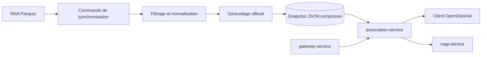

# Association Service — plan MVP

> Statut : proposition d’implémentation
> Périmètre initial : Val-d’Aigoual, code INSEE `30339`
> Architecture cible : microservice v2 derrière `gateway-service`
> Source principale : Répertoire national des associations

## 1. Objectif

Créer un microservice simple permettant de consulter et de cartographier les associations officiellement déclarées sur une commune française, avec un premier déploiement limité à Val-d’Aigoual.

Le MVP doit répondre à quatre questions :

1. Quelles associations sont rattachées à la commune ?
2. Quel est leur objet et leur domaine d’activité ?
3. Quel est leur statut administratif connu ?
4. Quand et depuis quelle source les informations ont-elles été mises à jour ?

Le statut administratif ne doit pas être présenté comme une preuve d’activité locale récente.

## 2. Périmètre fonctionnel

### Inclus

- recherche par code INSEE ;
- recherche textuelle sur le titre, le sigle et l’objet ;
- filtre par statut administratif ;
- filtre par catégorie RNA ;
- fiche détaillée d’une association ;
- adresse officielle publiée par la source ;
- géocodage de cette adresse ;
- cartographie des sièges ;
- statistiques simples par commune ;
- provenance, date de mise à jour et état de fraîcheur ;
- gestion des anciennes communes composant Val-d’Aigoual.

### Hors périmètre

- annuaire des dirigeants ou membres ;
- enrichissement avec des coordonnées non publiées par les sources officielles ;
- subventions, comptes annuels et effectifs salariés ;
- validation par la mairie ;
- historique détaillé des annonces JOAFE ;
- contribution directe des associations ;
- fonctions d’export dédiées ;
- couverture nationale chargée intégralement en mémoire.

Les réponses JSON ordinaires de l’API suffisent pour les usages applicatifs. Aucun module CSV ou GeoJSON d’export n’est prévu dans le MVP.

## 3. Sources de données

### Source principale

**RNA agrégé à l’échelle nationale**, publié sur data.gouv.fr en CSV et Parquet et reconstruit à partir des fichiers RNA Import et Waldec.

- jeu de données : `https://www.data.gouv.fr/datasets/rna-agrege-a-lechelle-nationale`
- format recommandé : Parquet ;
- fréquence de contrôle : hebdomadaire ;
- fréquence attendue de la source : mensuelle ;
- licence : Licence Ouverte 2.0.

### Sources complémentaires

- référentiel des communes via `geo.api.gouv.fr` ;
- service officiel de géocodage de la Géoplateforme ;
- référentiels géographiques déjà disponibles dans OpenDataVal.

Le MVP ne doit pas dépendre de l’API Association pour fonctionner. Elle pourra être ajoutée ultérieurement comme source d’enrichissement.

## 4. Cas particulier de Val-d’Aigoual

Val-d’Aigoual est une commune nouvelle. Le filtre d’import doit reconnaître :

| Territoire source | Code ou libellé |
|---|---|
| Val-d’Aigoual actuel | `30339` |
| Ancienne commune de Valleraugue | `30339` et libellé `VALLERAUGUE` |
| Ancienne commune de Notre-Dame-de-la-Rouvière | `30190` |
| Libellés possibles | `VAL-D'AIGOUAL`, `VALLERAUGUE`, `NOTRE-DAME-DE-LA-ROUVIERE` |
| Code postal indicatif | `30570` |

La normalisation produit `codeInsee = 30339` tout en conservant le code et le nom de commune fournis par la source.

Les correspondances historiques sont stockées dans un référentiel versionné et non codées directement dans les fonctions métier.

## 5. Architecture MVP



### Composants

- `apps/association-service/` : API Node.js / TypeScript ;
- `scripts/sync-rna.ts` : téléchargement, filtrage et normalisation ;
- `scripts/geocode-associations.ts` : géocodage des adresses officielles ;
- volume persistant : `/var/lib/opendataval/association-service/` ;
- snapshot courant : `associations-30339.json.gz` ;
- manifeste : `manifest.json` avec URL, empreinte, date source, date de génération et nombre de lignes ;
- image Docker indépendante ;
- routage public par `gateway-service`.

### Stockage

Aucune base de données métier pour le MVP.

Le service charge en mémoire uniquement le snapshot des communes configurées. Le dernier snapshot valide est conservé après redémarrage. Une synchronisation en échec ne remplace jamais le snapshot courant.

## 6. Modèle de données public

```ts
export type AssociationSummary = {
  rnaId: string | null;
  legacyId: string | null;
  title: string;
  shortTitle: string | null;
  purpose: string | null;
  categoryPrimary: string | null;
  categorySecondary: string | null;
  administrativeStatus: "active" | "dissolved" | "unknown";
  creationDate: string | null;
  declarationDate: string | null;
  dissolutionDate: string | null;
  website: string | null;
  siren: string | null;
  siret: string | null;
  address: {
    label: string | null;
    street: string | null;
    postalCode: string | null;
    municipalityName: string;
    sourceCommuneCode: string | null;
    normalizedCommuneCode: string;
  };
  location: {
    latitude: number;
    longitude: number;
    precision: "address" | "street" | "municipality";
    score: number | null;
  } | null;
  source: {
    name: "RNA";
    sourceUpdatedAt: string | null;
    importedAt: string;
  };
};
```

### Règle de publication

Le service reprend les informations officiellement diffusées par le RNA. Il n’ajoute pas de coordonnées personnelles provenant d’autres sources et ne publie pas d’informations internes sur les dirigeants.

L’adresse officielle du siège peut être affichée et géocodée puisqu’elle provient du service public source. La réponse conserve toujours la provenance et la précision du géocodage.

## 7. API publique

### Liste et recherche

```http
GET /api/v2/associations?code_insee=30339
GET /api/v2/associations?code_insee=30339&q=patrimoine
GET /api/v2/associations?code_insee=30339&status=active
GET /api/v2/associations?code_insee=30339&category=culture
```

Paramètres :

- `code_insee` obligatoire ;
- `q`, `status`, `category` facultatifs ;
- `limit` borné à 100 ;
- `cursor` pour la pagination stable ;
- tri par défaut : titre normalisé.

### Fiche

```http
GET /api/v2/associations/{rnaId}
```

Les associations anciennes sans numéro RNA utilisent un identifiant historique stable distinct.

### Statistiques

```http
GET /api/v2/associations/stats?code_insee=30339
```

Réponse minimale :

- total ;
- nombre par statut ;
- nombre par catégorie principale ;
- créations par année ;
- proportion de fiches avec SIREN/SIRET ;
- proportion d’adresses géocodées ;
- date du snapshot.

### Cartographie

```http
GET /api/v2/associations/map?code_insee=30339
```

La route retourne un `FeatureCollection` GeoJSON destiné à l’affichage cartographique. Il ne s’agit pas d’un module d’export générique.

Les coordonnées correspondent à l’adresse officielle géocodée. En cas d’échec, le service utilise le centroïde de la commune et indique `precision = municipality`.

### Exploitation

```http
GET /healthz
GET /readyz
GET /internal/v1/associations/status
POST /internal/v1/associations/sync
```

La route de synchronisation est interne et non exposée par Caddy.

## 8. Normalisation et déduplication

Ordre de priorité des identifiants :

1. numéro RNA ;
2. identifiant historique fourni par le fichier Import ;
3. identifiant synthétique stable construit à partir de la source.

Règles :

- ne jamais fusionner deux lignes sur le seul titre ;
- dédupliquer par identifiant officiel ;
- normaliser espaces, apostrophes, accents et majuscules uniquement pour la recherche ;
- conserver les valeurs originales pour l’affichage ;
- convertir les dates invalides en `null` avec un avertissement de qualité ;
- ne jamais transformer un statut absent en `active` ;
- conserver la trace du fichier et de la ligne source ;
- conserver l’adresse originale avant normalisation et géocodage.

## 9. Fraîcheur et résilience

États publics :

- `fresh` : snapshot de moins de 45 jours ;
- `stale` : snapshot de 45 à 90 jours ;
- `expired` : snapshot de plus de 90 jours ;
- `unavailable` : aucun snapshot valide.

Comportement :

- téléchargement dans un fichier temporaire ;
- validation du schéma et du nombre de lignes ;
- calcul SHA-256 ;
- géocodage mis en cache ;
- remplacement atomique du snapshot ;
- conservation du snapshot précédent ;
- restauration automatique après redémarrage ;
- réponse avec données anciennes et statut `stale` plutôt qu’une panne totale.

## 10. Étapes d’implémentation

### Étape 1 — Contrats et fixtures

- créer les types TypeScript ;
- définir les schémas Zod ;
- ajouter une fixture RNA réduite ;
- documenter les alias communaux de Val-d’Aigoual.

### Étape 2 — Synchronisation

- télécharger le Parquet ;
- sélectionner les colonnes nécessaires ;
- filtrer les communes configurées ;
- normaliser les lignes ;
- générer le snapshot et le manifeste ;
- rendre l’opération idempotente.

### Étape 3 — Géocodage

- construire une adresse normalisée ;
- interroger le service officiel de géocodage ;
- mettre les résultats en cache ;
- conserver le score et la précision ;
- utiliser le centroïde communal en dernier recours.

### Étape 4 — API

- implémenter liste, recherche, fiche, statistiques et cartographie ;
- ajouter pagination et validation d’entrée ;
- appliquer le format d’erreur commun OpenDataVal ;
- propager `x-request-id`.

### Étape 5 — Intégration OpenDataVal

- ajouter la route au gateway ;
- ajouter le conteneur Docker et son volume ;
- ajouter les checks de santé ;
- connecter la route cartographique à `map-service` sans y placer la logique métier.

### Étape 6 — Validation et déploiement

- synchroniser Val-d’Aigoual ;
- comparer un échantillon avec la recherche publique du Journal officiel ;
- vérifier les anciennes communes ;
- contrôler les adresses et la précision du géocodage ;
- déployer derrière `/api/v2/associations`.

## 11. Tests obligatoires

### Tests unitaires

- normalisation des identifiants ;
- interprétation des statuts ;
- alias `30190` vers `30339` ;
- déduplication ;
- recherche accentuée et non accentuée ;
- catégories absentes ;
- dates invalides ;
- normalisation des adresses ;
- gestion des niveaux de précision du géocodage.

### Tests d’intégration

- création d’un snapshot depuis la fixture ;
- restauration après redémarrage ;
- refus d’un snapshot incomplet ;
- conservation du dernier snapshot valide en cas d’échec ;
- pagination stable ;
- cache de géocodage ;
- GeoJSON valide pour la carte.

### Tests de déploiement

```bash
curl -fsS "http://localhost:8080/api/v2/associations?code_insee=30339"
curl -fsS "http://localhost:8080/api/v2/associations/stats?code_insee=30339"
curl -fsS "http://localhost:8080/api/v2/associations/map?code_insee=30339"
```

## 12. Critères d’acceptation

Le MVP est validé lorsque :

- le service fonctionne sans base de données ;
- le snapshot survit à un redémarrage ;
- les associations de Val-d’Aigoual et de ses anciennes communes sont prises en compte ;
- la liste peut être recherchée et filtrée ;
- chaque réponse indique la source et la fraîcheur ;
- l’adresse officielle est restituée lorsqu’elle est fournie par le RNA ;
- la cartographie indique la précision de chaque position ;
- une panne de la source ne rend pas indisponible le dernier snapshot valide ;
- les routes publiques passent par le gateway ;
- les tests automatiques et les tests de fumée sont verts.

## 13. Limites assumées

- une association administrativement active peut ne plus avoir d’activité réelle ;
- certaines associations anciennes n’ont pas de numéro RNA ;
- les catégories RNA peuvent être absentes ou trop générales ;
- le siège ne correspond pas toujours au lieu d’activité ;
- certaines adresses sont incomplètes ou difficiles à géocoder ;
- la mise à jour n’est pas temps réel.

Ces limites doivent être affichées dans la documentation de l’API et dans l’interface utilisateur.