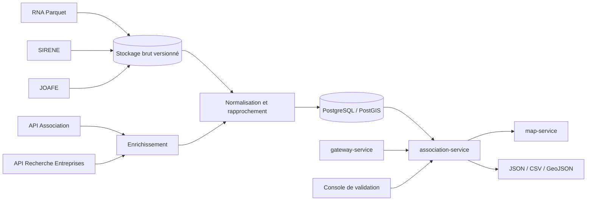

# Association Service — plan du produit complet

> Statut : cible fonctionnelle et technique après validation du MVP
> Périmètre : France, recherche nationale et usages territoriaux
> Architecture cible : service métier indépendant, PostgreSQL/PostGIS, synchronisations multi-sources
> Sources vérifiées le 27 juillet 2026

## 1. Vision du produit

Construire le référentiel territorial des associations d’OpenDataVal.

Le produit complet doit permettre de trouver, comprendre, comparer et cartographier les associations présentes dans un territoire, tout en distinguant clairement :

- l’existence juridique ;
- le statut administratif ;
- le siège déclaré ;
- les établissements connus ;
- le territoire d’action déclaré ou confirmé ;
- les signes récents d’activité ;
- la provenance et la qualité de chaque information.

Le service reste un service de données. Il ne devient ni un réseau social, ni un outil de gestion interne des associations, ni un registre alternatif au RNA.

## 2. Principes structurants

1. **Le RNA reste la source juridique principale.**
2. **SIRENE complète le RNA**, mais ne remplace pas les associations sans SIREN/SIRET.
3. **Le JOAFE représente des événements**, pas une photographie consolidée.
4. **Une association active administrativement n’est pas nécessairement active localement.**
5. **Le siège n’est pas toujours le lieu d’activité.**
6. **Chaque valeur importante doit conserver sa provenance.**
7. **Les données personnelles ne sont pas un produit.**
8. **La cartographie précise n’est publiée que lorsque le lieu est professionnel, public ou validé.**
9. **Les corrections locales ne doivent jamais écraser silencieusement la source nationale.**
10. **Le service doit continuer à répondre avec le dernier état valide lorsque les producteurs sont indisponibles.**

## 3. Périmètre fonctionnel complet

### Recherche et consultation

- recherche nationale par nom, sigle, objet ou identifiant ;
- recherche par commune, EPCI, département, région ou emprise cartographique ;
- recherche autour d’un point et dans un rayon ;
- filtre par statut administratif ;
- filtre par domaine d’activité ;
- filtre par présence d’un SIREN/SIRET ;
- filtre par activité locale confirmée ;
- filtre par date de création, modification ou dissolution ;
- fiche consolidée avec sources et dates ;
- historique des changements connus ;
- liste des établissements publics connus ;
- affichage des communes et territoires d’action confirmés.

### Cartographie

- points précis pour les établissements SIRET géocodés ;
- points précis pour les lieux publics vérifiés ;
- points au centroïde communal pour les sièges potentiellement résidentiels ;
- clusters et agrégations par maille ;
- filtres cartographiques par catégorie et statut ;
- export GeoJSON ;
- styles et légendes servis par `map-service` ;
- logique métier conservée dans `association-service`.

### Statistiques territoriales

- nombre d’associations enregistrées ;
- densité pour 1 000 habitants ;
- créations et dissolutions par année ;
- répartition par catégorie ;
- ancienneté médiane ;
- part disposant d’un SIREN/SIRET ;
- part avec établissement employeur lorsque l’information est disponible ;
- part avec activité locale confirmée ;
- évolution par commune, EPCI, département et région ;
- comparaison avec des territoires de référence.

Les statistiques doivent toujours afficher les limites de couverture et la date des sources.

### Validation locale

- interface réservée aux collectivités ou administrateurs ;
- confirmation qu’une association exerce encore une activité locale ;
- ajout d’un lieu public d’activité ;
- ajout d’un site web ou d’une page officielle ;
- signalement d’une donnée obsolète ;
- ajout d’une note publique structurée ;
- journal d’audit complet ;
- date d’expiration automatique des validations locales ;
- possibilité de contredire localement une donnée sans modifier la valeur source.

### Contribution associative facultative

- demande de revendication d’une fiche ;
- vérification par courriel de domaine, document ou validation locale ;
- mise à jour de données non juridiques : site web, domaines d’action, lieux publics, horaires, territoire couvert ;
- aucune modification directe des champs juridiques issus du RNA ou de SIRENE ;
- conservation de la source `association_declared` et de la date de confirmation.

## 4. Sources et rôle de chacune

| Source | Rôle | Mode d’intégration | Autorité |
|---|---|---|---|
| RNA agrégé data.gouv.fr | identité, objet, statut, dates, siège déclaré | import complet Parquet | principale pour les associations loi 1901 |
| Répertoire SIRENE | SIREN/SIRET, établissements, activité APE, état administratif | fichiers ou API autorisée | principale pour les établissements |
| API Recherche d’Entreprises | recherche et géolocalisation complémentaire | API publique avec cache | complémentaire |
| API Association en open data | fiche consolidée RNA/SIRENE lorsque l’accès est disponible | API avec jeton et quotas | enrichissement |
| JOAFE | créations, modifications, dissolutions et annonces | API ou fichiers d’événements | historique événementiel |
| Référentiels INSEE/geo.api.gouv.fr | communes, EPCI, départements, régions et évolutions géographiques | import versionné | autorité territoriale |
| Géocodage Géoplateforme | géocodage d’adresses autorisées | traitement par lots avec cache | localisation technique |
| Validation locale | présence et activité territoriale confirmées | interface authentifiée | complément local daté |
| Déclaration associative | site, lieux publics et domaines d’action | contribution vérifiée | complément déclaratif daté |

Références officielles :

- RNA agrégé : `https://www.data.gouv.fr/datasets/rna-agrege-a-lechelle-nationale`
- JOAFE et API : `https://www.journal-officiel.gouv.fr/pages/donnees-ouvertes-et-api/`
- API Association : `https://entreprise.api.gouv.fr/catalogue/djepva/associations_open_data`
- API Recherche d’Entreprises : `https://recherche-entreprises.api.gouv.fr/docs/`
- référentiels géographiques : `https://geo.api.gouv.fr/`
- documentation Adresse : `https://doc.adresse.data.gouv.fr/`

## 5. Architecture cible



### Composants

- `apps/association-service/` : API publique et interne ;
- `workers/association-sync/` : imports complets et incrémentaux ;
- PostgreSQL 16 / PostGIS ;
- stockage objet ou volume versionné pour les fichiers sources ;
- file de travaux légère pour géocodage et enrichissements ;
- cache Redis facultatif uniquement si le trafic le justifie ;
- console d’administration séparée ;
- métriques Prometheus et journaux structurés.

### Séparation des responsabilités

- `gateway-service` valide et route ;
- `association-service` possède la logique métier et les contrats ;
- `geography-service` résout les territoires et les géométries ;
- `map-service` fournit styles, tuiles, glyphes et légendes ;
- les workers importent les sources sans exposer de route publique.

## 6. Modèle de données cible

### Tables principales

#### `associations`

- `id` UUID interne ;
- `rna_id` unique nullable ;
- `legacy_rna_id` nullable ;
- `siren` nullable ;
- `title`, `short_title`, `purpose` ;
- `administrative_status` ;
- `creation_date`, `declaration_date`, `dissolution_date` ;
- `legal_regime` ;
- `recognized_public_utility` nullable ;
- `current_source_record_id` ;
- timestamps techniques.

#### `association_categories`

- catégorie source principale ;
- catégorie source secondaire ;
- catégorie OpenDataVal normalisée ;
- méthode de classement : `source`, `rule`, `manual` ;
- score de confiance.

#### `establishments`

- SIRET ;
- état administratif ;
- activité APE ;
- siège ou établissement secondaire ;
- effectif par tranche lorsqu’il est public ;
- adresse de travail ;
- géométrie et précision.

#### `association_locations`

- type : siège, établissement, lieu d’activité, commune couverte ;
- géométrie ;
- précision ;
- visibilité publique ;
- source ;
- date de confirmation ;
- date d’expiration.

#### `territorial_links`

- association ;
- type de territoire ;
- code territoire ;
- nature du lien : siège, établissement, activité déclarée, activité confirmée ;
- source et confiance.

#### `association_events`

- type : création, modification, transfert, dissolution, publication de comptes ;
- date ;
- source JOAFE ou autre ;
- payload original référencé ;
- empreinte de déduplication.

#### `source_records`

- producteur ;
- fichier, ressource ou endpoint ;
- identifiant externe ;
- contenu brut ou référence vers le stockage brut ;
- date source ;
- date d’import ;
- empreinte ;
- statut de traitement.

#### `local_validations`

- association ;
- champ validé ;
- valeur ;
- collectivité ou compte validateur ;
- justificatif facultatif ;
- date de validation ;
- date d’expiration ;
- statut ;
- journal d’audit.

#### `sync_runs`

- source ;
- début et fin ;
- version du fichier ;
- empreinte ;
- lignes lues, acceptées, rejetées et modifiées ;
- erreurs ;
- statut final.

## 7. Rapprochement des identités

### Règles fortes

- même `rna_id` : même association ;
- même `siren` confirmé par la source : même association économique ;
- même `siret` : même établissement ;
- les identifiants officiels ne sont jamais recalculés.

### Règles prudentes

Un rapprochement par titre, adresse ou objet ne doit jamais fusionner automatiquement deux associations sans identifiant commun.

Les correspondances probabilistes sont stockées comme candidats :

- `candidate_match` ;
- score ;
- motifs ;
- décision automatique interdite au-dessus d’un risque défini ;
- validation manuelle possible.

### Communes nouvelles

Un référentiel historique versionné doit gérer :

- fusions ;
- créations ;
- changements de code ;
- changements de nom ;
- communes déléguées ;
- dates de validité.

Chaque enregistrement conserve le territoire source et le territoire courant normalisé.

## 8. Politique de localisation

### Niveaux de précision

| Niveau | Publication | Usage |
|---|---|---|
| `exact_establishment` | oui | établissement SIRET ou lieu public |
| `verified_public_place` | oui | salle, équipement ou local confirmé |
| `street_generalized` | exceptionnel | adresse professionnelle sans point fiable |
| `municipality_centroid` | oui | siège potentiellement résidentiel |
| `territory_only` | oui | territoire d’action sans adresse |
| `unknown` | non cartographié | information insuffisante |

### Géocodage

- utiliser le service de géocodage de la Géoplateforme, et non l’ancienne API Adresse dépréciée ;
- géocoder seulement les adresses autorisées ;
- stocker la réponse, le score et la version du géocodeur ;
- ne pas relancer les adresses inchangées ;
- limiter les appels et reprendre après erreur ;
- refuser les résultats hors de la commune attendue sans validation.

## 9. API cible

### Recherche

```http
GET /api/v2/associations
```

Paramètres principaux :

- `q` ;
- `code_insee`, `epci`, `department`, `region` ;
- `bbox` ou `lat`, `lon`, `radius_km` ;
- `status` ;
- `category` ;
- `local_activity=confirmed|probable|unknown` ;
- `has_siret` ;
- `created_from`, `created_to` ;
- `updated_since` ;
- `limit`, `cursor`, `sort`.

### Fiche consolidée

```http
GET /api/v2/associations/{rnaOrSiren}
GET /api/v2/associations/{rnaOrSiren}/establishments
GET /api/v2/associations/{rnaOrSiren}/timeline
GET /api/v2/associations/{rnaOrSiren}/sources
```

### Territoires

```http
GET /api/v2/associations/territories/{type}/{code}
GET /api/v2/associations/stats/{type}/{code}
GET /api/v2/associations/map/{type}/{code}
```

### Exports

```http
GET /api/v2/associations/export?format=csv&code_insee=30339
GET /api/v2/associations/export?format=geojson&department=30
```

Les exports volumineux sont produits de façon asynchrone côté serveur avec un fichier temporaire signé. Cette mécanique ne doit pas être utilisée pour les réponses ordinaires.

### Routes internes

```http
GET  /internal/v1/associations/status
POST /internal/v1/associations/sync/{source}
POST /internal/v1/associations/reconcile
POST /internal/v1/associations/geocode
POST /internal/v1/associations/validate
```

Toutes les routes internes sont authentifiées, auditées et inaccessibles depuis Internet.

## 10. Recherche et classement

### Recherche textuelle

- index PostgreSQL `tsvector` en français ;
- index trigramme pour titres proches ;
- normalisation des apostrophes, tirets, accents et sigles ;
- pondération : titre, sigle, catégories, objet ;
- surbrillance des termes ;
- pagination par curseur.

### Catégorisation

Ordre de priorité :

1. catégories RNA ;
2. activité APE des établissements ;
3. règles transparentes sur l’objet ;
4. validation locale ou associative ;
5. classification automatique seulement comme suggestion.

Toute catégorie calculée doit exposer sa méthode et son niveau de confiance.

## 11. Indicateurs de qualité

Chaque fiche reçoit des indicateurs séparés, et non une note opaque unique :

- `identity_quality` ;
- `status_freshness` ;
- `location_precision` ;
- `local_activity_confidence` ;
- `source_completeness` ;
- `last_confirmed_at`.

Exemples :

- `administrative_status = active` ;
- `local_activity = unknown` ;
- `location_precision = municipality` ;
- `last_confirmed_at = null`.

Le client ne doit jamais présenter `active` comme synonyme de « propose actuellement des activités ».

## 12. Fraîcheur, synchronisation et historique

### Pipeline en trois niveaux

1. **Brut** : fichiers originaux, métadonnées et empreintes ;
2. **Normalisé** : schéma commun sans perte de provenance ;
3. **Public** : vue filtrée, sécurisée et optimisée pour l’API.

### Stratégie

- import complet périodique du RNA ;
- import complet ou différentiel de SIRENE selon le canal choisi ;
- ingestion régulière des événements JOAFE ;
- enrichissements API mis en cache ;
- réconciliation complète périodique ;
- historisation des changements significatifs ;
- remplacement transactionnel de la vue publique ;
- possibilité de rejouer un import à partir des fichiers bruts.

### Résilience

- circuit breaker pour chaque API externe ;
- reprise sur erreur ;
- quotas par source ;
- temporisation exponentielle ;
- file morte pour les enregistrements invalides ;
- conservation de la dernière vue publique valide ;
- alertes en cas de retard ou baisse anormale du volume.

## 13. Confidentialité et sécurité

### Données exclues de l’API publique

- identité des dirigeants ;
- documents contenant des données personnelles ;
- courriels et téléphones personnels ;
- adresse précise d’un siège résidentiel ;
- justificatifs de validation ;
- informations non diffusibles de SIRENE ;
- données issues d’un accès administratif non autorisées à la rediffusion.

### Mesures techniques

- liste blanche des champs publics ;
- séparation des schémas PostgreSQL brut, interne et public ;
- chiffrement des secrets ;
- rotation des jetons ;
- limitation de débit ;
- protection contre l’énumération massive ;
- journaux sans données personnelles ;
- audit des validations et contributions ;
- suppression et expiration des données contributives devenues inutiles.

## 14. Console de validation

### Fonctions

- recherche d’une association ;
- comparaison source nationale / donnée locale ;
- confirmation d’activité ;
- ajout d’un lieu public ;
- signalement d’une incohérence ;
- validation ou refus d’une contribution ;
- affichage de l’historique ;
- export des modifications ;
- expiration et renouvellement des validations.

### Rôles

- `viewer` ;
- `local_validator` limité à un territoire ;
- `moderator` ;
- `service_admin`.

Les droits territoriaux doivent être explicites et testés.

## 15. Observabilité

### Métriques

- durée et statut des synchronisations ;
- date du dernier import valide par source ;
- nombre d’associations et d’établissements ;
- lignes rejetées ;
- rapprochements ambigus ;
- taux de géocodage ;
- appels et erreurs des API externes ;
- temps de réponse par route ;
- taux de cache ;
- exports générés ;
- validations expirées.

### Journaux

Tous les journaux sont structurés et contiennent :

- `request_id` ;
- service et version ;
- source ;
- opération ;
- durée ;
- statut ;
- erreur normalisée ;
- aucun contenu personnel brut.

## 16. Plan de réalisation

### Phase 1 — Industrialiser le MVP

- migrer le snapshot MVP vers une table d’import ;
- conserver les contrats publics existants ;
- ajouter migrations SQL et PostGIS ;
- importer plusieurs communes pilotes ;
- valider les performances.

### Phase 2 — Couverture nationale RNA

- charger tout le RNA ;
- intégrer le référentiel historique des communes ;
- ajouter recherche nationale et agrégations territoriales ;
- mettre en place les imports rejouables ;
- publier les indicateurs de qualité.

### Phase 3 — SIRENE et établissements

- rapprocher RNA et SIRENE par identifiants officiels ;
- ajouter établissements et activités APE ;
- intégrer les coordonnées géographiques autorisées ;
- publier les lieux précis seulement selon la politique de confidentialité.

### Phase 4 — JOAFE et historique

- ingérer les annonces ;
- construire la chronologie ;
- détecter les changements ;
- mettre en place la réconciliation avec le prochain import RNA complet.

### Phase 5 — Validation locale

- créer l’authentification et les rôles ;
- développer la console ;
- ajouter audit, expiration et modération ;
- tester avec Val-d’Aigoual et une seconde collectivité.

### Phase 6 — Contributions associatives

- revendication de fiche ;
- vérification ;
- contribution sur les données non juridiques ;
- modération ;
- gestion des retraits et expirations.

### Phase 7 — Généralisation

- optimisation nationale ;
- exports volumineux ;
- documentation publique ;
- supervision et objectifs de service ;
- tests de charge ;
- ouverture progressive à d’autres territoires.

## 17. Tests obligatoires

### Données

- import RNA Import et Waldec ;
- stabilité des identifiants ;
- absence de fusion abusive ;
- communes nouvelles ;
- changements de code ;
- doublons JOAFE ;
- réconciliation RNA/SIRENE ;
- précision géographique ;
- suppression des champs interdits.

### API

- contrats OpenAPI ;
- pagination stable ;
- recherche accentuée ;
- filtres territoriaux ;
- statistiques reproductibles ;
- GeoJSON valide ;
- exports conformes ;
- propagation de `x-request-id` ;
- erreurs normalisées.

### Sécurité

- contrôle des rôles ;
- isolation territoriale ;
- absence de données personnelles dans les journaux ;
- limitation de débit ;
- tentative d’énumération ;
- accès impossible aux routes internes depuis Caddy ;
- contrôle des fichiers d’export.

### Exploitation

- restauration après redémarrage ;
- reprise d’un import interrompu ;
- rollback de la vue publique ;
- indisponibilité d’une source ;
- dépassement de quota ;
- corruption d’un fichier ;
- migrations avant et arrière compatibles avec la stratégie de déploiement.

## 18. Critères d’acceptation du produit complet

Le produit est considéré complet lorsque :

- la couverture RNA nationale est importée et versionnée ;
- les recherches territoriales répondent sans charger le corpus en mémoire ;
- RNA, SIRENE et JOAFE sont rapprochés sans fusion probabiliste silencieuse ;
- chaque donnée importante expose sa source et sa date ;
- les communes nouvelles et anciennes géographies sont correctement résolues ;
- les lieux précis respectent la politique de confidentialité ;
- les statistiques sont reproductibles ;
- les validations locales sont auditées et expirables ;
- une source externe indisponible ne provoque pas la perte de la dernière vue valide ;
- les performances, la sécurité et les procédures de restauration sont testées ;
- la documentation OpenAPI, les limites fonctionnelles et les licences sont publiées.

## 19. Migration depuis le MVP

La migration doit rester progressive :

1. conserver les routes MVP ;
2. importer le snapshot dans PostgreSQL ;
3. comparer les réponses JSON avant bascule ;
4. activer la base par drapeau de fonctionnalité ;
5. conserver un rollback vers le snapshot ;
6. ajouter les nouvelles sources une par une ;
7. ne publier aucune précision géographique supplémentaire avant validation de la politique de confidentialité.

Le MVP reste donc un sous-ensemble contractuel du produit complet, et non un prototype jetable.

## 20. Risques principaux

| Risque | Réponse |
|---|---|
| association active mais inactive localement | distinguer statut administratif et activité confirmée |
| siège résidentiel publié sur une carte | généraliser au centroïde communal |
| fusion erronée de deux associations | identifiants officiels obligatoires pour fusion automatique |
| données anciennes après fusion de communes | référentiel historique versionné |
| dépendance à une API avec jeton | import RNA autonome et enrichissements facultatifs |
| changement de schéma source | validation de schéma, alertes et conservation du dernier import valide |
| catégories imprécises | exposer source, méthode et confiance |
| corrections locales non traçables | journal d’audit et expiration |
| volumétrie nationale | PostgreSQL/PostGIS, index et pagination par curseur |
| exposition de données personnelles | vue publique en liste blanche et tests automatisés |

## 21. Décision recommandée

Commencer par le MVP Val-d’Aigoual, valider la qualité du RNA et les règles de confidentialité, puis étendre dans cet ordre :

1. couverture RNA nationale ;
2. historique territorial ;
3. SIRENE et établissements ;
4. JOAFE ;
5. validation locale ;
6. contributions associatives.

Cette progression maintient un service utile à chaque étape et évite de transformer immédiatement un annuaire simple en plateforme administrative complexe.