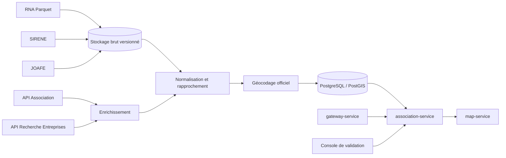

# Association Service — plan du produit complet

> Statut : cible fonctionnelle et technique après validation du MVP
> Périmètre : France, recherche nationale et usages territoriaux
> Architecture cible : service métier indépendant, PostgreSQL/PostGIS, synchronisations multi-sources

## 1. Vision du produit

Construire le référentiel territorial des associations d’OpenDataVal.

Le produit complet doit permettre de trouver, comprendre, comparer et cartographier les associations présentes dans un territoire, tout en distinguant :

- l’existence juridique ;
- le statut administratif ;
- le siège officiel ;
- les établissements connus ;
- le territoire d’action déclaré ou confirmé ;
- les signes récents d’activité ;
- la provenance et la qualité de chaque information.

Le service reste un service de données. Il ne devient ni un réseau social, ni un outil de gestion interne des associations, ni un registre alternatif au RNA.

## 2. Principes structurants

1. **Le RNA reste la source juridique principale.**
2. **SIRENE complète le RNA**, mais ne remplace pas les associations sans SIREN/SIRET.
3. **Le JOAFE représente des événements**, pas une photographie consolidée.
4. **Une association active administrativement n’est pas nécessairement active localement.**
5. **Le siège officiel n’est pas toujours le lieu d’activité.**
6. **Chaque donnée importante conserve sa provenance et sa date.**
7. **Les adresses officiellement publiées peuvent être reprises, géocodées et cartographiées.**
8. **Le service n’ajoute pas de coordonnées personnelles provenant de sources non officielles.**
9. **Les corrections locales ne remplacent jamais silencieusement la source nationale.**
10. **Le dernier état valide reste disponible lorsque les producteurs externes sont indisponibles.**

## 3. Périmètre fonctionnel complet

### Recherche et consultation

- recherche nationale par nom, sigle, objet ou identifiant ;
- recherche par commune, EPCI, département, région ou emprise cartographique ;
- recherche autour d’un point et dans un rayon ;
- filtre par statut administratif ;
- filtre par domaine d’activité ;
- filtre par présence d’un SIREN/SIRET ;
- filtre par activité locale confirmée ;
- filtre par date de création, modification ou dissolution ;
- fiche consolidée avec sources et dates ;
- historique des changements connus ;
- liste des établissements connus ;
- affichage des communes et territoires d’action confirmés.

### Cartographie

- position précise du siège lorsqu’une adresse officielle est exploitable ;
- position précise des établissements SIRET ;
- position des lieux publics d’activité confirmés ;
- repli sur la rue ou le centroïde communal en cas de géocodage insuffisant ;
- clusters et agrégations par maille ;
- filtres cartographiques par catégorie et statut ;
- route GeoJSON dédiée à l’affichage ;
- styles et légendes servis par `map-service` ;
- logique métier conservée dans `association-service`.

### Statistiques territoriales

- nombre d’associations enregistrées ;
- densité pour 1 000 habitants ;
- créations et dissolutions par année ;
- répartition par catégorie ;
- ancienneté médiane ;
- part disposant d’un SIREN/SIRET ;
- part avec établissement employeur lorsque l’information est publique ;
- part avec activité locale confirmée ;
- évolution par commune, EPCI, département et région ;
- comparaison avec des territoires de référence.

Les statistiques affichent toujours leur date de référence et les limites de couverture.

### Validation locale

- interface réservée aux collectivités ou administrateurs ;
- confirmation qu’une association exerce encore une activité locale ;
- ajout d’un lieu public d’activité ;
- ajout d’un site web officiel ;
- signalement d’une donnée obsolète ;
- ajout d’une note publique structurée ;
- journal d’audit ;
- date d’expiration des validations locales ;
- possibilité de compléter une donnée sans effacer la valeur source.

### Contribution associative facultative

- revendication d’une fiche ;
- vérification de la demande ;
- mise à jour de données non juridiques : site web, domaines d’action, lieux publics, horaires, territoire couvert ;
- aucune modification directe des champs juridiques issus du RNA ou de SIRENE ;
- conservation de la source déclarative et de la date de confirmation.

### Fonctions non retenues

- module d’export CSV ou archive téléchargeable ;
- duplication des jeux de données nationaux déjà téléchargeables sur data.gouv.fr ;
- gestion des adhérents, cotisations ou activités internes ;
- diffusion de coordonnées collectées hors des sources officielles.

Les réponses JSON et la route GeoJSON cartographique suffisent aux usages de l’application.

## 4. Sources et rôle de chacune

| Source | Rôle | Mode d’intégration | Autorité |
|---|---|---|---|
| RNA agrégé data.gouv.fr | identité, objet, statut, dates et siège déclaré | import complet Parquet | principale pour les associations loi 1901 |
| Répertoire SIRENE | SIREN/SIRET, établissements, activité APE et état administratif | fichiers ou API autorisée | principale pour les établissements |
| API Recherche d’Entreprises | recherche et géolocalisation complémentaire | API publique avec cache | complémentaire |
| API Association en open data | fiche consolidée RNA/SIRENE lorsque disponible | API avec cache | enrichissement |
| JOAFE | créations, modifications et dissolutions | API ou fichiers d’événements | historique événementiel |
| Référentiels INSEE/geo.api.gouv.fr | communes, EPCI, départements, régions et évolutions géographiques | import versionné | autorité territoriale |
| Géocodage Géoplateforme | coordonnées des adresses officielles | traitement par lots avec cache | localisation technique |
| Validation locale | présence et activité territoriale confirmées | interface authentifiée | complément local daté |
| Déclaration associative | site, lieux publics et domaines d’action | contribution vérifiée | complément déclaratif daté |

## 5. Architecture cible



### Composants

- `apps/association-service/` : API publique et interne ;
- `workers/association-sync/` : imports complets et incrémentaux ;
- PostgreSQL 16 / PostGIS ;
- stockage versionné pour les fichiers sources ;
- file de travaux pour le géocodage et les enrichissements ;
- cache Redis facultatif si le trafic le justifie ;
- console d’administration séparée ;
- métriques Prometheus et journaux structurés.

### Séparation des responsabilités

- `gateway-service` valide et route ;
- `association-service` possède les données et la logique métier ;
- `geography-service` résout les territoires et géométries ;
- `map-service` fournit styles, tuiles, glyphes et légendes ;
- les workers importent les sources sans exposer de route publique.

## 6. Modèle de données cible

### `associations`

- identifiant UUID interne ;
- numéro RNA ;
- identifiant historique éventuel ;
- SIREN éventuel ;
- titre, sigle et objet ;
- statut administratif ;
- dates de création, déclaration et dissolution ;
- régime juridique ;
- référence vers l’enregistrement source courant.

### `association_categories`

- catégorie RNA principale ;
- catégorie RNA secondaire ;
- catégorie OpenDataVal normalisée ;
- méthode de classement ;
- score de confiance.

### `official_addresses`

- adresse officielle originale ;
- adresse normalisée ;
- code postal ;
- commune source ;
- commune normalisée ;
- source et date ;
- état courant ou historique.

### `association_locations`

- type : siège, établissement, lieu d’activité ou territoire couvert ;
- géométrie ;
- précision : adresse, rue ou commune ;
- score de géocodage ;
- source ;
- date de confirmation.

### `establishments`

- SIRET ;
- état administratif ;
- activité APE ;
- siège ou établissement secondaire ;
- tranche d’effectif lorsqu’elle est publique ;
- adresse officielle ;
- géométrie et précision.

### `territorial_links`

- association ;
- type et code du territoire ;
- nature du lien : siège, établissement, activité déclarée ou activité confirmée ;
- source et niveau de confiance.

### `association_events`

- création, modification, transfert ou dissolution ;
- date ;
- source JOAFE ou autre ;
- référence vers le contenu source ;
- empreinte de déduplication.

### `source_records`

- producteur ;
- fichier, ressource ou endpoint ;
- identifiant externe ;
- référence vers le contenu brut ;
- date source ;
- date d’import ;
- empreinte ;
- statut de traitement.

### `local_validations`

- association ;
- champ validé ;
- valeur ;
- collectivité ou compte validateur ;
- date de validation ;
- date d’expiration ;
- statut ;
- journal d’audit.

### `sync_runs`

- source ;
- début et fin ;
- version du fichier ;
- empreinte ;
- lignes lues, acceptées, rejetées et modifiées ;
- erreurs ;
- statut final.

## 7. Rapprochement des identités

### Règles fortes

- même numéro RNA : même association ;
- même SIREN confirmé : même association économique ;
- même SIRET : même établissement ;
- les identifiants officiels ne sont jamais recalculés.

### Règles prudentes

Un rapprochement par titre, adresse ou objet ne fusionne jamais automatiquement deux associations sans identifiant officiel commun.

Les rapprochements incertains sont enregistrés comme candidats avec :

- score ;
- motifs ;
- sources comparées ;
- statut de décision ;
- validation manuelle éventuelle.

### Communes nouvelles

Un référentiel historique versionné gère :

- fusions ;
- créations ;
- changements de code ;
- changements de nom ;
- communes déléguées ;
- dates de validité.

Chaque fiche conserve le territoire source et le territoire courant normalisé.

## 8. Politique de géocodage

### Niveaux de précision

| Niveau | Usage |
|---|---|
| `exact_address` | adresse officielle correctement géocodée |
| `exact_establishment` | établissement SIRET correctement géocodé |
| `verified_public_place` | lieu d’activité confirmé |
| `street` | adresse partiellement résolue |
| `municipality` | repli au centroïde communal |
| `unknown` | absence de position exploitable |

### Règles

- utiliser le service officiel de géocodage de la Géoplateforme ;
- géocoder les adresses officielles publiées par les sources ;
- conserver la valeur source, la valeur normalisée, le score et la précision ;
- ne pas relancer les adresses inchangées ;
- limiter les appels et reprendre après erreur ;
- contrôler la cohérence entre résultat géocodé et commune attendue ;
- utiliser le centroïde communal en dernier recours ;
- permettre la correction locale d’une position erronée sans supprimer la donnée source.

## 9. API cible

### Recherche

```http
GET /api/v2/associations
```

Paramètres principaux :

- `q` ;
- `code_insee`, `epci`, `department`, `region` ;
- `bbox` ou `lat`, `lon`, `radius_km` ;
- `status` ;
- `category` ;
- `local_activity=confirmed|probable|unknown` ;
- `has_siret` ;
- `created_from`, `created_to` ;
- `updated_since` ;
- `limit`, `cursor`, `sort`.

### Fiche consolidée

```http
GET /api/v2/associations/{rnaOrSiren}
GET /api/v2/associations/{rnaOrSiren}/establishments
GET /api/v2/associations/{rnaOrSiren}/timeline
GET /api/v2/associations/{rnaOrSiren}/sources
```

### Territoires et cartographie

```http
GET /api/v2/associations/territories/{type}/{code}
GET /api/v2/associations/stats/{type}/{code}
GET /api/v2/associations/map/{type}/{code}
```

La route `map` retourne un GeoJSON optimisé pour l’application. Elle ne constitue pas un système d’export documentaire.

### Routes internes

```http
GET  /internal/v1/associations/status
POST /internal/v1/associations/sync/{source}
POST /internal/v1/associations/reconcile
POST /internal/v1/associations/geocode
POST /internal/v1/associations/validate
```

Toutes les routes internes sont authentifiées, auditées et inaccessibles depuis Internet.

## 10. Recherche et classement

### Recherche textuelle

- index PostgreSQL `tsvector` en français ;
- index trigramme pour titres proches ;
- normalisation des apostrophes, tirets, accents et sigles ;
- pondération du titre, du sigle, des catégories et de l’objet ;
- pagination par curseur.

### Catégorisation

Ordre de priorité :

1. catégories RNA ;
2. activité APE des établissements ;
3. règles transparentes appliquées à l’objet ;
4. validation locale ou associative ;
5. classification automatique uniquement comme suggestion.

Toute catégorie calculée expose sa méthode et son niveau de confiance.

## 11. Indicateurs de qualité

Chaque fiche expose des indicateurs séparés :

- `identity_quality` ;
- `status_freshness` ;
- `location_precision` ;
- `local_activity_confidence` ;
- `source_completeness` ;
- `last_confirmed_at`.

Exemple :

```json
{
  "administrative_status": "active",
  "local_activity": "unknown",
  "location_precision": "exact_address",
  "last_confirmed_at": null
}
```

Le client ne présente jamais `active` comme synonyme de « propose actuellement des activités ».

## 12. Fraîcheur, synchronisation et historique

### Pipeline

1. **Brut** : fichiers originaux, métadonnées et empreintes ;
2. **Normalisé** : schéma commun sans perte de provenance ;
3. **Public** : vue optimisée pour l’API.

### Stratégie

- import complet périodique du RNA ;
- import complet ou différentiel de SIRENE ;
- ingestion régulière des événements JOAFE ;
- enrichissements API mis en cache ;
- géocodage différentiel ;
- réconciliation complète périodique ;
- historisation des changements significatifs ;
- remplacement transactionnel de la vue publique ;
- possibilité de rejouer un import depuis les fichiers bruts.

### Résilience

- circuit breaker pour chaque API externe ;
- reprise sur erreur ;
- quotas par source ;
- temporisation exponentielle ;
- file d’erreurs pour les enregistrements invalides ;
- conservation de la dernière vue publique valide ;
- alertes en cas de retard ou de baisse anormale du volume.

## 13. Données et sécurité

### Données publiques

Le service peut diffuser :

- l’identité officielle de l’association ;
- son objet ;
- son statut ;
- les dates officielles ;
- l’adresse du siège officiellement publiée ;
- les établissements SIRET publics ;
- les sites web et lieux publics validés ;
- la géolocalisation issue de ces adresses.

### Données exclues

- informations obtenues par un accès administratif non rediffusable ;
- justificatifs internes ;
- secrets d’API ;
- coordonnées ajoutées depuis une source non officielle sans validation ;
- données internes de modération.

### Mesures techniques

- liste blanche des champs publics ;
- séparation des schémas PostgreSQL brut, interne et public ;
- chiffrement des secrets ;
- rotation des jetons ;
- limitation de débit ;
- journaux sans contenus bruts inutiles ;
- audit des validations et contributions.

## 14. Console de validation

### Fonctions

- recherche d’une association ;
- comparaison source nationale / donnée locale ;
- confirmation d’activité ;
- correction d’une géolocalisation ;
- ajout d’un lieu public ;
- signalement d’une incohérence ;
- validation ou refus d’une contribution ;
- affichage de l’historique ;
- expiration et renouvellement des validations.

### Rôles

- `viewer` ;
- `local_validator` limité à un territoire ;
- `moderator` ;
- `service_admin`.

Les droits territoriaux doivent être explicites et testés.

## 15. Observabilité

### Métriques

- durée et statut des synchronisations ;
- date du dernier import valide par source ;
- nombre d’associations et d’établissements ;
- lignes rejetées ;
- rapprochements ambigus ;
- taux de géocodage ;
- précision moyenne des positions ;
- appels et erreurs des API externes ;
- temps de réponse par route ;
- taux de cache ;
- validations expirées.

### Journaux

Les journaux structurés contiennent :

- `request_id` ;
- service et version ;
- source ;
- opération ;
- durée ;
- statut ;
- erreur normalisée.

## 16. Plan de réalisation

### Phase 1 — Industrialiser le MVP

- migrer le snapshot MVP vers une table d’import ;
- conserver les contrats publics existants ;
- ajouter les migrations SQL et PostGIS ;
- importer plusieurs communes pilotes ;
- valider les performances.

### Phase 2 — Couverture nationale RNA

- charger tout le RNA ;
- intégrer le référentiel historique des communes ;
- ajouter recherche nationale et agrégations territoriales ;
- mettre en place les imports rejouables ;
- publier les indicateurs de qualité.

### Phase 3 — SIRENE et établissements

- rapprocher RNA et SIRENE par identifiants officiels ;
- ajouter établissements et activités APE ;
- géocoder les adresses officielles ;
- distinguer siège et établissements.

### Phase 4 — JOAFE et historique

- ingérer les annonces ;
- construire la chronologie ;
- détecter les changements ;
- réconcilier les événements avec le prochain import RNA complet.

### Phase 5 — Validation locale

- créer l’authentification et les rôles ;
- développer la console ;
- ajouter audit, expiration et modération ;
- tester avec Val-d’Aigoual et une seconde collectivité.

### Phase 6 — Contributions associatives

- permettre la revendication de fiche ;
- vérifier les demandes ;
- accepter les contributions sur les données non juridiques ;
- mettre en place la modération ;
- gérer les retraits et expirations.

### Phase 7 — Généralisation

- optimiser la recherche nationale ;
- publier la documentation publique ;
- renforcer la supervision ;
- exécuter les tests de charge ;
- ouvrir progressivement à d’autres territoires.

## 17. Tests obligatoires

### Données

- import RNA Import et Waldec ;
- stabilité des identifiants ;
- absence de fusion abusive ;
- communes nouvelles ;
- changements de code ;
- doublons JOAFE ;
- réconciliation RNA/SIRENE ;
- normalisation des adresses ;
- cohérence du géocodage.

### API

- contrats OpenAPI ;
- pagination stable ;
- recherche accentuée ;
- filtres territoriaux ;
- statistiques reproductibles ;
- GeoJSON cartographique valide ;
- propagation de `x-request-id` ;
- erreurs normalisées.

### Sécurité

- contrôle des rôles ;
- isolation territoriale ;
- absence de secrets dans les journaux ;
- limitation de débit ;
- accès impossible aux routes internes depuis Caddy.

### Exploitation

- restauration après redémarrage ;
- reprise d’un import interrompu ;
- retour à la vue publique précédente ;
- indisponibilité d’une source ;
- dépassement de quota ;
- corruption d’un fichier ;
- migrations compatibles avec la stratégie de déploiement.

## 18. Critères d’acceptation du produit complet

Le produit est considéré complet lorsque :

- la couverture RNA nationale est importée et versionnée ;
- les recherches territoriales répondent sans charger le corpus en mémoire ;
- RNA, SIRENE et JOAFE sont rapprochés sans fusion probabiliste silencieuse ;
- chaque donnée importante expose sa source et sa date ;
- les communes nouvelles et anciennes géographies sont correctement résolues ;
- les adresses officielles sont restituées et géocodées avec leur précision ;
- les statistiques sont reproductibles ;
- les validations locales sont auditées et expirables ;
- une source externe indisponible ne provoque pas la perte de la dernière vue valide ;
- les performances, la sécurité et les procédures de restauration sont testées ;
- la documentation OpenAPI, les limites fonctionnelles et les licences sont publiées.

## 19. Migration depuis le MVP

La migration reste progressive :

1. conserver les routes MVP ;
2. importer le snapshot dans PostgreSQL ;
3. comparer les réponses JSON avant bascule ;
4. activer la base par drapeau de fonctionnalité ;
5. conserver un retour possible vers le snapshot ;
6. ajouter les nouvelles sources une par une ;
7. comparer les positions géographiques avant publication.

Le MVP reste un sous-ensemble contractuel du produit complet et non un prototype jetable.

## 20. Risques principaux

| Risque | Réponse |
|---|---|
| association active mais inactive localement | distinguer statut administratif et activité confirmée |
| géocodage erroné d’une adresse officielle | conserver score, précision et commune attendue |
| fusion erronée de deux associations | identifiants officiels obligatoires pour fusion automatique |
| données anciennes après fusion de communes | référentiel historique versionné |
| dépendance à une API avec jeton | import RNA autonome et enrichissements facultatifs |
| changement de schéma source | validation de schéma, alertes et conservation du dernier import valide |
| catégories imprécises | exposer source, méthode et confiance |
| corrections locales non traçables | journal d’audit et expiration |
| volumétrie nationale | PostgreSQL/PostGIS, index et pagination par curseur |

## 21. Décision recommandée

Commencer par le MVP Val-d’Aigoual, valider la qualité du RNA et du géocodage, puis étendre dans cet ordre :

1. couverture RNA nationale ;
2. historique territorial ;
3. SIRENE et établissements ;
4. JOAFE ;
5. validation locale ;
6. contributions associatives.

Cette progression maintient un service utile à chaque étape sans transformer immédiatement un annuaire simple en plateforme administrative complexe.